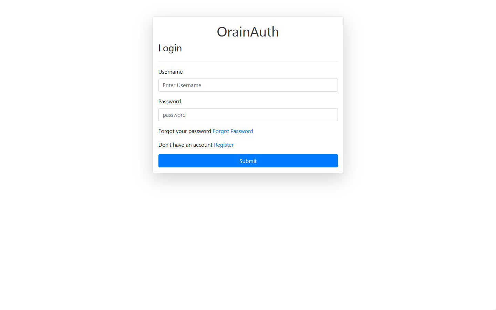
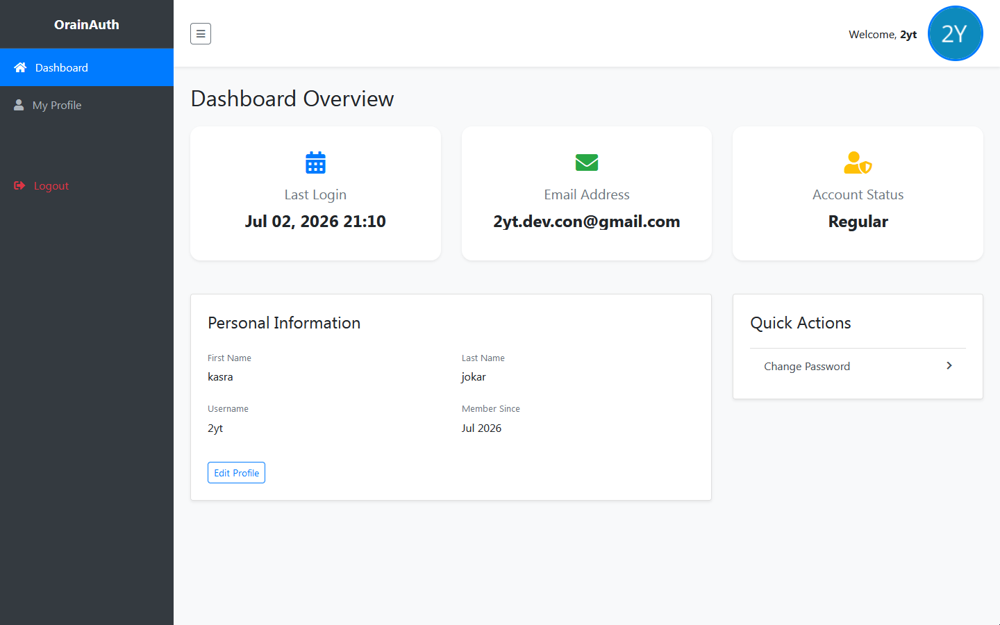
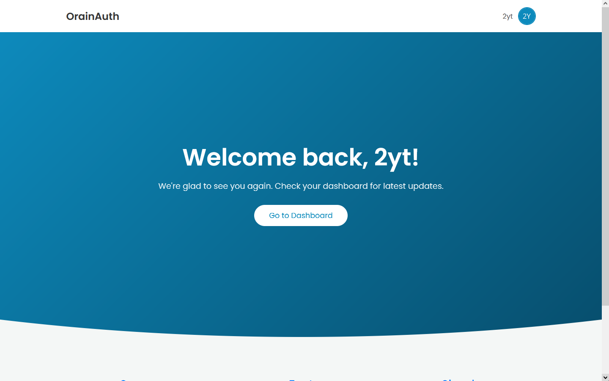

# OrainAuth - Django

[](https://www.python.org/)
[](https://www.djangoproject.com/)

## Table of Contents

- [Features](#features)
- [Tech Stack](#tech-stack)
- [Prerequisites](#prerequisites)
- [Installation](#installation)
- [Usage](#usage)
- [Screenshots](#screenshots)
- [Contributing](#contributing)

## Features

- **Custom User Model:** Fully customizable user profiles using Django's `AbstractUser`
- **Secure Authentication:** Password hashing, CSRF protection, and session-based security

## Tech Stack

- **Backend:** [Python](https://www.python.org/) & [Django](https://www.djangoproject.com/)
- **Frontend:** HTML5, CSS3, [Bootstrap 4/5](https://getbootstrap.com/)
- **Database:** MySQL
- **Security:** Django Middleware, CSRF Tokens, Password Hashing

## Prerequisites

- Python 3.9+
- MySQL Server
- Git

## Installation

Follow these steps to get a local copy up and running:

1. **Clone the repository:**

```bash
   git clone https://github.com/2yt-code/OrainAuth.git
   cd OrainAuth
```

2. **Create a Virtual Environment:**

```bash
   python -m venv venv
   # On Windows:
   venv\Scripts\activate
   # On Linux:
   source venv/bin/activate
```

3. **Install dependencies:**

```bash
   pip install -r requirements.txt
```

4. **Creating the .env file:**

The project uses environment variables for sensitive information
Copy the example environment file:
```bash
   # For Windows
   copy .env.example .env
   # For linux
   cp .env.example .env
```
Open the `.env` file and update `SECRET_KEY`. By default the project uses SQLite (`DB_ENGINE=sqlite`). To use MySQL instead, set `DB_ENGINE=mysql` and fill in the database credentials.

5. **Database Setup:**

**SQLite (default):** no extra setup needed.

**MySQL:** create a database first:
```sql
   CREATE DATABASE orainauth;
```
Ensure your MySQL user has permissions to access this database

6. **Run Migrations:**

```bash
   python manage.py migrate
```

7. **Start the Server:**

```bash
   python manage.py runserver
```

Now open http://127.0.0.1:8000/ in your browser

## Usage

To access the authentication flow:

    - Login: accounts/login
    - Register:  accounts/register
    - Dashboard: dashboard/
    - Home : /

## Screenshots





## Contributing

Contributions are what make the open-source community such an amazing place to learn, inspire, and create. Any contributions you make are greatly appreciated

1. Fork the Project
2. Create your Feature Branch (git checkout -b feature/AmazingFeature)
3. Commit your Changes (git commit -m 'Add some AmazingFeature')
4. Push to the Branch (git push origin feature/AmazingFeature)
5. Open a Pull Request

I would appreciate it if you could add a star to support my project 🙏